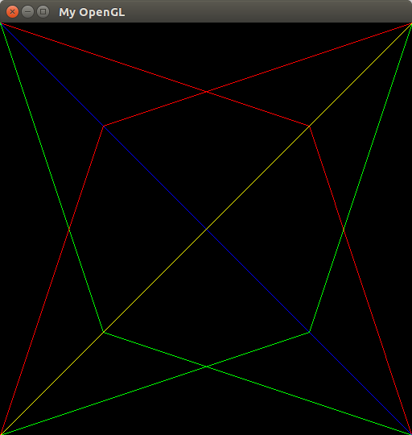

# Pipeline Gráfico: Rasterização de Primitivas

---

## Introdução

Esta postagem é parte obrigatoria da primeira avaliação prática da disciplina de Introdução à Computação Gráfica, ministrada pelo Prof. Christian Pagot no semestre letivo 2016.1.

As definições e especificações projeto podem ser acessadas através deste [link](https://github.com/jcarva/rasterization/blob/master/project_definition.pdf).

Como explanado em sala de aula pelo Prof. Christian Pagot, qualquer conteúdo teórico extra-atividade não obrigatóriamente precisa ser descrito na postagem.

Todo o código citado está disponivel neste [repositorio público](https://github.com/jcarva/rasterization) e acessivel também para [download direto](https://github.com/jcarva/rasterization/archive/master.zip).

As etapas do desenvolvimento do projeto estão divididas em branchs no repositorio.

Caso o código ou a corrente postagem seja de alguma ajuda peço para que contribua com seu [Star](https://github.com/jcarva/rasterization) no repositorio do projeto.


**Tem alguma questão ou sugestão?**																												
Contate-me no [Linkedin](https://www.linkedin.com/in/jaelson-carvalho-4b84a3a2?trk=nav_responsive_tab_profile_pic), envie um email para jaelsoncarvalhojr@gmail.com, ou crie um pull request neste projeto. Toda ajuda e qualquer é bem vinda.

---

## 1. Rasterização de Pontos
<br>
Rasterizar pontos é o trabalho de "escrever" tais pontos na memória de vídeo, especialmente no colorbuffer, e que como resultado obtemos uma representação deste ponto na tela, que geralmente podemos denomina-lo pixel. Assim como na descrição matemática, em nosso caso cada ponto é formado por duas coordenadas, ```x``` e ```y``` que demarcam sua posição no espaço ou tela. Todo ponto representado na tela possui um cor, que é a informação registrada na memória de vídeo.

Antes de dar continuidade com a rasterização de pontos propriamente dita, é necessario que saibamos como de fato o colorbuffer. Podemos defini-lo como uma estrutura com espaço de coordenadas unidimensional. Sabendo que os pontos representados na tela possuem coordenadas bidimensionais, é necessario um mapeamento 2D => 1D para que possamos ter consistencia ao armazenarmos todos os pontos a serem escritos no colorbuffer.

Tal mapeamento supracitado pode ser obtido através da função Offset, descrita abaixo.

``` c++
int Pixel::Offset(int column, int row)
{
	return (column  + row * IMAGE_WIDTH) * 4;
}
```
Onde o argumento ```column``` representa a coordenada ```x``` do ponto em um espaço bidimensional, e o argumento ```row``` representa a coordenada ```y``` do mesmo ponto.

O valor de retorno da função Offset corresponde a posição do primeiro dos 4 bytes que guardam a cor do pixel em relação ao endereço do ponteiro do colorbuffer.

Você pode estar pensando : "***Como assim 4 bytes para uma cor?***"

Em nosso sistema um cor RGBA cada byte representa a intensidade das cores primarias usadas, sendo o primeiro byte para a cor vermelha(Red-R), e dando sequencia com verde(Green-G), azul(Blue-B) e Alpha-A(usado para transparência) respectivamente.

Sabendo disso, agora temos conhecimento suficiente para desenvolver a primeira das funções obrigatorias descritas na [especificação do projeto](https://github.com/jcarva/rasterization/blob/master/project_definition.pdf), a função ***PutPixel***.

### PutPixel

``` c++
void Pixel::PutPixel(int x, int y, double RGBA[4])
{
	if ((x >= 0 && x <= IMAGE_WIDTH) && (y >= 0 && y <= IMAGE_HEIGHT))
	{
		offset = Offset(x, y);

		for (int i = 0; i < 4; i++)
		{
			FBptr[offset + i] = (int)RGBA[i];
		}
	}
	else
	{
		std::clog << "Invalid PutPixel Position : [ x:" << x << " , y:" << y << " ]" << std::endl;
	}
}
``` 

Com a função acima devidamente implementada já podemos usa-la como no exemplo abaixo.

``` c++
double red[4] = { 255, 0, 0, 255 };
double green[4] = { 0, 255, 0, 255 };
double blue[4] = { 0, 0, 255, 255 };
double yellow[4] = { 255, 255, 0, 255 };

Pixel reference_pixel= Pixel(0,0);

reference_pixel.PutPixel(140, 140, red);
reference_pixel.PutPixel(140, 280, green);
reference_pixel.PutPixel(280, 280, blue);
reference_pixel.PutPixel(280, 420, yellow);
```


Assim obtemos os primeiros resultados na tela como mostra a **Figura 1**.

<p align="center">
	<br>
	
	<h5 align="center">Figura 1</h5>
	<br>
</p>

---

## 2. Rasterização de Retas
<br>
A ação de rasterizar retas é o ato de gerar pontos em um especifico intervalo, podendo ser utilizado para o desenho de linhas na tela.

A tarefa desta etapa pode ser feita de várias maneiras, diferentes métodos e algoritmos. O algoritmo utilizado nesta implementação foi o Algoritmo de Bresenham.

Encarado como um dos mais efetivos para a tarefa de rasterização de linhas, mas a sua forma básica possui algumas limitações, tal forma pode ser visualizada logo abaixo.

``` c++
void Line::DrawLine(Pixel initial, Pixel final, double color[4])
{
	Pixel reference_pixel = Pixel(0,0);

	int deltaX = final.column - initial.column;
	int deltaY = final.row - initial.row;
	int d = (2 * deltaY) - deltaX;
	int increase_e = 2 * deltaY;
	int increase_ne = 2 * (deltaY - deltaX);
	int x = initial.column;
	int y = initial.row;

	reference_pixel.PutPixel(x,y,color);

	while(x < final.column) {
		if (d <= 0)
		{
			d += increase_e;
			x++;
		}
		else
		{
			d += increase_ne;
			x++;
			y++;
		}
		reference_pixel.PutPixel(x,y,color);
	}

}
```

Nesta forma o Algoritmo de Bresenham tem a restrição de suportar somente o 1º octante, isto é, só é capaz de de realizar a rasterização de retas(``` y = mx + b ```) que possuem o coeficiente angular(```0 ≤ m ≤ 1 ```) em um determinado intervalo, ou seja, retas que possuem ângulos entre 0°e 45° quando tenhamos o eixo X como referência.

Podemos conferir a deficiência do algoritmo em sua forma atual, basta tentar renderizar uma reta que foge dos limites do escopo suportado, isto é, ângulos de 0° até 45°. 

``` c++
double red[4] = {255, 0, 0, 255};
Line().DrawLine("OUT", Pixel(0,0), Pixel(100,150), red);
```

A **Figura 2** mostra a pretensão de renderizar uma reta fora do escopo tolerado, a mesma será denominada de ```OUT```, com ponto inicial ```init(0, 0)``` e final ```final(100,150)```.

<p align="center">
	<br>
	
	<h5 align="center">Figura 2</h5>
	<br>
</p>

A reta ```OUT``` foi transformada em uma reta com inclinação de 45° e com tamanho relativo ao valor da coordenada ```x``` no ponto final. Isso ocorre por que o ```deltaY > deltaX```, ou seja, a distancia dos pontos em relação a coordenada ```y``` é maior que a distancia dos pontos em relação a coordenada ```x```. Logo as variaveis ```d(fator de decisão)```, ```increase_e(incremento para a leste)```, ```increase_ne(incremento para nordeste)``` se tornam positivos, resultando com que o algoritmo de Bresenham interprete que a reta possui uma inclinação de 45°, e assim sempre incrementando ambas as coordenadas ```x``` e ```y```. A **Figura 3** mostra os dados obtidos(somente uma parte dos dados estão sendo mostradas, pois o padrão se repete até o fim do processamento) na tentativa de renderizar a reta ```OUT```, e a mesma confirma a explicação dada.

<p align="center">
	<br>
	
	<h5 align="center">Figura 3</h5>
	<br>
</p>


Sabendo da existência de tal problema é necessaria uma generalização do algoritmo de rasterização para podermos desenhar qualquer linha, não importando sua inclinação em relação ao ```x```. porém antes é necessaio que entendamos como o espaço utilizado será dividido e conceitos de octantes.

Podemos definir octante como metade de um quadrante do plano cartesiano, e os mesmos são limitados por fronteiras com ângulos de inclinações de 45°. A **Figura 4** ilustra bem o conceito de octantes.

<p align="center">
	<br>
	
	<h5 align="center">Figura 4</h5>
	<br>
</p>


#### Generalização do Algoritimo de Bresenham

Esta etapa do projeto podemos dizer que é onde foi gasto a maior parte do tempo de desenvolvimento, porém após uma serie de pesquisas e estudos se chegou a uma conclusão satisfatoria, simples e curta, sem grandes mudanças na forma básica do algoritmo de rasterização utilizado.

A primeira tentantiva de generalização foi através da verificação e criação de casos especiais para cada quadrante e octante. Tal solução se mostrou nada eficaz, elegante ou fácil, nos levando a um gasto de energia muito grande, produzindo largos blocos de códigos repetitivos, e muitos condicionais lógicos. A solução se baseava nos seguintes passos :

	1. Calculo das variaveis deltaY e deltaX.
	2. Examina os valores de deltaY e deltaX com o intuito de indicar se reta cresce ou descrece.
	3. Caso a reta cresça é atribuido 1 aos incremetos em x e y, caso contrario recebem -1.
	4. Verifica se deltaY > deltaX, caso seja troca os valores de x e y. de cada extremo.
	5. Examina se o valor da coordenada x do primeiro eixo é superior ao valor da primeira coordenada, se for, trocamos os dois eixos do plano.

Onde tal solução logo foi descartada devido a surgimento de erros em casos especificos, a possibilidade de alcançarmos um código mais legivel, com mais vantagens, e sem os problemas já supracitados.

Após a leitura de artigos sobre [transformações lineares](http://www3.fsa.br/localuser/Anastassios/FAENG%20AMBIENTAL%20ALGEBRA%20LINEAR/AL%20A%20Resumo%2010%20Transformacoes%20Lineares%20no%20Plano%20e%20no%20Espa%C3%A7o.pdf), [matrizes de reflexão](http://wiki.ued.ipleiria.pt/wikiEngenharia/index.php/Matriz_de_reflex%C3%A3o) uma nova e simples solução para a generalização do algoritmo de Bresenham surgiu.

A nova solução se resume em aplicar(quando necessario) algumas transformações na reta em que temos a inteção de renderizar. Onde podemos resumir essas tranformações em apenas 3.

Antes da explicação das transformações é necessario que saibamos importantes variaveis utilizadas por elas e pelo algoritmo de Bresenham generalizado.

``` c++
/*
	Variable that represents the 'while' limit to put pixels, always will receive the reference axis' maximum value.
*/
int limit;
```

``` c++
/*
	Respresentation of the reference and complementary axes. They are necessary to generalize the Bresenham Algorithm to any octante, so we need change the 'while' stop condition, and do octante transformations.
*/
int * reference_axis;
int * complementary_axis;
```

``` c++
/*
	Beyond line coordenates to generalize the Bresenham Algorithm to any octante, so we need change the 'while' stop condition.
*/
int x_limit;
int y_limit;
```

##### Transformação 1 : ```Reflexão em torno do eixo y, sendo a origem da coordenada x o valor a coordenada x do ponto inicial da será renderizada```

Caso onde a coordenada x do ponto inicial seja maior que a do ponto final, ou seja, ```initial.column > final.column```.

``` c++
if (initial.column > final.column)		//Set x limit
	x_limit = (initial.column - final.column) + initial.column;
else
	x_limit = final.column; 			//Base case Brenseham Algorithm
```
A equação ```x_limit = (initial.column - final.column) + initial.column``` representa a transformação linear em torno do eixo y. Estando ciente que as matrizes de transformações usadas como referência são para retas com o ponto inicial na origem, é necessario a soma da variavel ```initial.column```, que é a distância da coordenada x do ponto inicial até a coordenada x da origem.

Sabendo que o calculo de um vetor AB, com ponto inicial A(Xa, Ya) e final B(Xb, Yb) é dado por ((Xb - Xa), (Yb - Ya)), e querendo evitar a multiplicação da matriz de transformação por ```-1```, inverte-se a ordem dos operandos para (Xa - Xb), assim chegando a ```x_limit = (initial.column - final.column) + initial.column```.

##### Transformação 2 : ```Reflexão em torno do eixo x, sendo a origem da coordenada y o valor a coordenada y do ponto inicial da será renderizada```

Caso onde a coordenada y do ponto inicial seja maior que a do ponto final, ou seja, ```initial.row > final.row```.

``` c++
if (initial.row > final.row)		//Set y limit
	y_limit = (initial.row - final.row) + initial.row;
else
	y_limit = final.row; 			//Base case Brenseham Algorithm
```
A equação ```y_limit = (initial.row - final.row) + initial.row``` representa a transformação linear em torno do eixo x. Estando ciente que as matrizes de transformações usadas como referência são para retas com o ponto inicial na origem, é necessario a soma da variavel ```initial.column```, que é a distância da coordenada y do ponto inicial até a coordenada y da origem.

Sabendo que o calculo de um vetor AB, com ponto inicial A(Xa, Ya) e final B(Xb, Yb) é dado por ((Xb - Xa), (Yb - Ya)), e querendo evitar a multiplicação da matriz de transformação por ```-1```, inverte-se a ordem dos operandos para (Ya - Yb), assim chegando a ```y_limit = (initial.row - final.row) + initial.row```.

##### Transformação 3 : ```Reflexão em torno da reta y = x```

Caso onde ```x_limit - initial.column``` for menor que ```y_limit - initial.row```, ou seja, ```deltaX < deltaY```, logo a reta irá inidicar uma inclinação superior à 45º.

``` c++
if(deltaX < deltaY) {
    int tmp = deltaX;
    deltaX = deltaY;
    deltaY = tmp;

    limit = y_limit;

    reference_axis = &y;
    complementary_axis = &x;
}
else {
	limit = x_limit;

	reference_axis = &x;
	complementary_axis = &y;
}
```

O trecho de código acima representa a troca de valores entre ```deltaX``` e  ```deltaY```, a indicação do valor limite para o eixo de referência, e a escolha do eixo referência e do eixo complementar, passos necessarios para que possamos ter uma correta e completa rasterização usando o Algoritmo de Bresenham generalizado.

Com essas transformações devidamente entendidas e implementadas, temos o algoritmo de Bresenham totalmente implementado, podendo ser visualizado na classe [Line](https://github.com/jcarva/rasterization/blob/master/project/forms/line.h), inserido na segunda função obrigatoria descrita na [especificação do projeto](https://github.com/jcarva/rasterization/blob/master/project_definition.pdf), a função ***DrawLine***.

Com o algoritmo de Brensenham devidamente generalizado para qualquer inclinação de reta podemos renderizar seja qual for a linha na tela, e o resultado pode ser conferido na **Figura 5**.

<p align="center">
	<br>
	
	<h5 align="center">Figura 5</h5>
	<br>
</p>

---

## 3. Interpolação de Cores
<br>
A interpolação de cores em uma reta é dada pela mudança gradual de cor, ponto a ponto, partindo do ponto inicial com sua respectiva cor até chegar ao ponto final que também possui sua cor.

Sabendo que em nosso sistema de cores RGBA todas as cores possuem uma única e consistente representação númerica, façamos:

``` math
DIFF_COR = COR_FINAL - COR_INICIAL
```
Onde ```DIFF_COR``` é a diferença total entre a cor final e inicial, essa é diferença é obtida através da diferença de cada elemento das cores, ou seja :

``` math
DIFF_COR.RED = COR_FINAL.RED  - COR_INICIAL.RED
DIFF_COR.GREEN = COR_FINAL.GREEN  - COR_INICIAL.GREEN
DIFF_COR.BLUE = COR_FINAL.BLUE  - COR_INICIAL.BLUE
DIFF_COR.ALPHA = COR_FINAL.ALPHA  - COR_INICIAL.ALPHA
```

Caso somemos ```DIFF_COR``` a cor inicial, obteremos diretamente a cor final, porém isso não é uma interpolação, não é uma mudança gradual ponto a ponto. Para uma mudança gradual necessitamos de apenas uma pequena parte de ```DIFF_COR```, que será a cor incrementada a cada ponto, a denominaremos de ```INCREMENTAL_COLOR```, e podemos obter a mesma através da expressão :

``` math
INCREMENTAL_COLOR = DIFF_COR / TAMANHO_DA_LINHA
```
Do mesmo modo que ```DIFF_COR```, o ```INCREMENTAL_COLOR``` é cálculado através da manipulação de cada elemento das cores, ou seja:

``` c++
double incremental_color[4] = {
	(double) (final_color[0] - initial_color[0])/(buffer_line.size()),
	(double) (final_color[1] - initial_color[1])/(buffer_line.size()),
	(double) (final_color[2] - initial_color[2])/(buffer_line.size()),
	(double) (final_color[3] - initial_color[3])/(buffer_line.size())
};
```

No qual ```buffer_line``` é um atributo público da classe ```Line```, descrito por:

``` c++
std::vector<Pixel> buffer_line;
```

Tal atributo armazena todos os pontos da linha a serem desenhados na tela. Onde agora temos dados suficientes para desenhar uma linha completa com interpolação de cores, e isso é feito através da iteração sobre todo o ```buffer_line```.

``` c++
for (int i = 0 ; i < buffer_line.size() ; ++i)
{
	reference_pixel.PutPixel(buffer_line[i].column, buffer_line[i].row, resulting_color);

	resulting_color[0] += incremental_color[0];
	resulting_color[1] += incremental_color[1];
	resulting_color[2] += incremental_color[2];
	resulting_color[3] += incremental_color[3];
}
```

O resultado são linhas com interpolações de cores como podemos visualizar na **Figura 6**, que se mostra diferente da **Figura 5**, onde são as mesmas linhas porém com única cor.

<p align="center">
  
  <h5 align="center">Figura 6</h5>
</p>

---

## 4. Desenho de Triângulos
<br>
Após concluir com exito a construção de linhas, e o processo de interpolação de cores através da mesma, temos ferramentas suficientes para a contrução de um triângulo, cumprindo o desenvolvimento da terceira função obrigatoria descrita na [especificação do projeto](https://github.com/jcarva/rasterization/blob/master/project_definition.pdf), a função ***DrawTriangle***.

A lógica conceitual da implementação dessa função é receber três pontos quaisquer com suas respectivas cores, que serão os vertices do triângulo, e em seguida desenhar linhas de ligações e entre os vertices, ou seja, as arestas.

### DrawTriangle
``` c++
void Triangle::DrawTriangle(Pixel vertex1, Pixel vertex2, Pixel vertex3, int color_vertex1[4], int color_vertex2[4], int color_vertex3[4])
{
	Line().DrawLine("", vertex1, vertex2, color_vertex1, color_vertex2);
	Line().DrawLine("", vertex2, vertex3, color_vertex2, color_vertex3);
	Line().DrawLine("", vertex3, vertex1, color_vertex3, color_vertex1);
}
```

O resultado da chamada da função pode ser **Figura 7**.
<p align="center">
  
  <h5 align="center">Figura 7</h5>
</p>

---

## 5. Preenchimento de Triângulos
<br>
No inicio desta etapa do projeto, tal tarefa de preencher um triangulo me parecia um tanto difícil, porém após ler mais sobre o problema me veio em mente que este tipo de preenchimento nada mais é do que várias linhas agregagadas, tendo como referência um dos vertices do triângulo e variando o ponto final com suas respectivas mundanças de cores. ***"Hã?"***, ***"Como assim?"***, ***"Que pontos finais são esses?"***, ***"Como saber a mudança da cor?"***

Para um melhor entendimento vamos admitir a existência de um triângulo ABC. Este triângulo possui os vertices A(Xa, Ya), B(Xb, Yb), C(Xc, Yc), e assim como todo triângulo, existêm retas de ligações entre tais vertices, retas AB, BC, CA. Escolhendo o vertice A como referência inicial, e a reta BC como a refência final para o desenho das linhas agregadas, a solução para o problema se mostra quase concluída.

O que agora necessitamos é da reta BC e a cor incremental para cada pixel da mesma. Assim como citado na seção ***Interpolação de Cores***, todo objeto linha, possui o atributo público ```buffer_line``` que armazena todos os pontos de tal linha, ou seja, basta criar a linha com ponto inicial B, final C e obtemos a reta BC com todos os pixels finais de cada linha de preenchimento.

``` c++
std::vector<Pixel> buffer_line;
```
O dado que nos falta é saber qual é a cor de cada pixel final para o desenho da linha interpolada, onde usamos a mesta solução da seção ***Interpolação de Cores***.

Agora podemos aplicar a solução de preenchimento citada anteriormente, um simples laço que irá desenhar uma linha para cada ponto da reta BC, tendo como inicio o vértice A, e incrementando a cor a cada iteração. 

``` c++
for (int i = 0; i < reference_line.buffer_line.size() ; ++i)
{
	Line().DrawLine("", vertex1, reference_line.buffer_line[i], color_vertex1, final_color);

	reference_color[0] += dColor[0];
	reference_color[1] += dColor[1];
	reference_color[2] += dColor[2];
	reference_color[3] += dColor[3];

	final_color[0] = (int) reference_color[0];
	final_color[1] = (int) reference_color[1];
	final_color[2] = (int) reference_color[2];
	final_color[3] = (int) reference_color[3];
}
```

O resultado inicial que obtemos com o procedimento pode ser visualizado na **Figura 8** abaixo.

<p align="center">
  
  <h5 align="center">Figura 8</h5>
</p>

Podemos notar que existem alguns pontos de falha no preenchimento inicial, a explicação para isso é a repetição de alguns pixels de preenchimento em diferentes linhas, onde a consequência é a não rasterização de alguns outros, ou seja, os pontos de falhas. Isso ocorre devido a escolha feita pelo algoritimo de Bresenham para a rasterização do próximo ponto, onde tais pontos algumas vezes coincidem na rasterização de linhas distintas.

O problema citado no paragrafo anterior pode ser simplesmente resolvido com a criação da função ```FilledTriangle```, que executa o procedimento de preenchimento fazendo permutações entre os vertices do triângulo, cambiando o ponto referência inicial e a reta com os pontos finais.

``` c++
void Triangle::FilledTriangle(Pixel vertex1, Pixel vertex2, Pixel vertex3, int color_vertex1[4], int color_vertex2[4], int color_vertex3[4])
{
	DrawFilledTriangle(vertex1, vertex2, vertex3, color_vertex1, color_vertex2, color_vertex3);
	DrawFilledTriangle(vertex3, vertex1, vertex2, color_vertex3, color_vertex1, color_vertex2);
	DrawFilledTriangle(vertex2, vertex3, vertex1, color_vertex2, color_vertex3, color_vertex1);
}

```

Com a chamada da função acima temos o resultado na **Figura 9**.

<p align="center">
  
  <h5 align="center">Figura 9</h5>
</p>

Assim obtendo um resultado satisfatorio, um triângulo totalmente preenchido e sem pontos falhos.

---

## Dificuldades

---

## Possiveis trabalhos futuros

* Assim como o atributo ```buffer_line``` nos objetos da classe ```Line```,  o incremento de cor para o próximo ponto na interpolação de cores também poderia se tornar variavel de instancia da classe. Assim evitando calcular novamente quando feito o preenchimento de triângulos.

---

## Conclusão

---

## Referências

* [Bjarne Stroustrup's C++ Style and Technique FAQ](http://www.stroustrup.com/bs_faq2.html)

* [Bresenham's line algorithm - Wikipedia](https://en.wikipedia.org/wiki/Bresenham%27s_line_algorithm)

* [Matrizes de Reflexão](http://wiki.ued.ipleiria.pt/wikiEngenharia/index.php/Matriz_de_reflex%C3%A3o)

* Notas de Aula do Prof. Christian Pagot

* [Shapari - Reflexão em torno da reta y = x](http://www.ufrgs.br/espmat/disciplinas/tutoriais_softwares/shapari/shapari_rfxy.htm)

* [The Bresenham Line-Drawing Algorithm - Department of Computer Science, University of Helsinki](https://www.cs.helsinki.fi/group/goa/mallinnus/lines/bresenh.html)

* [Transformações Lineares](http://www3.fsa.br/localuser/Anastassios/FAENG%20AMBIENTAL%20ALGEBRA%20LINEAR/AL%20A%20Resumo%2010%20Transformacoes%20Lineares%20no%20Plano%20e%20no%20Espa%C3%A7o.pdf)