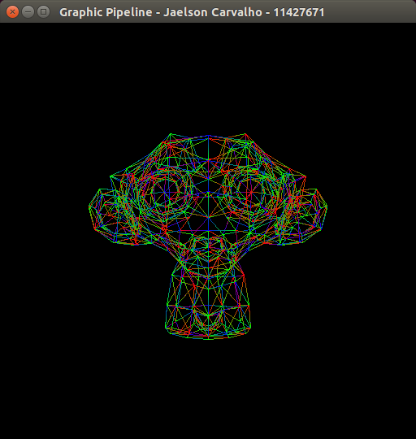

**Tem alguma questão ou sugestão?**																												
Contate-me no [Linkedin](https://www.linkedin.com/in/jaelson-carvalho-4b84a3a2?trk=nav_responsive_tab_profile_pic), envie um email para jaelsoncarvalhojr@gmail.com, ou crie um pull request neste projeto. Toda ajuda e qualquer é bem vinda.

# Pipeline Gráfico

---

Esta postagem é parte obrigatoria da segunda avaliação prática da disciplina de Introdução à Computação Gráfica, ministrada pelo Prof. Christian Pagot no semestre letivo 2016.1.

As definições e especificações projeto podem ser acessadas através deste [link](https://github.com/jcarva/computer_graphics_assignments/blob/master/graphic_pipeline/project_definition.pdf).

Como explanado em sala de aula pelo Prof. Christian Pagot, qualquer conteúdo teórico extra-atividade não obrigatóriamente precisa ser descrito na postagem.

Todo o código citado está disponivel neste [repositorio público](https://github.com/jcarva/computer_graphics_assignments/tree/master/graphic_pipeline) e acessivel também para [download direto](https://github.com/jcarva/computer_graphics_assignments/archive/master.zip).

Caso o código ou a corrente postagem seja de alguma ajuda peço para que contribua com seu [Star](https://github.com/jcarva/computer_graphics_assignments) no repositorio do projeto.

---

## Introdução

O objetivo final deste trabalho é a construção de um pipeline gráfico completo, realizando a implementação e explicação de todas as transformações contidas no mesmo.

Para uma leitura e viagem completa através do desevolvimento do pipeline gráfico a trilha sonora fica por conta da banda Pink Floyd, mais especificamente ao som de [Echoes](https://www.youtube.com/watch?v=HuBqE9xGtiQ), música do album Meddle de 1971.

<a href="https://www.youtube.com/watch?v=jzeNFjsrb1Q">
    <div style="margin: 40px;">
        <p align="center">Meddle - Echoes</p>
        <p align="center">
          
        </p>
    </div>
</a>

Antes de expor o que significa o pipeline gráfico propriamente dito, necessitamos enteder o conceito de espaço. Os espaços que aqui serão citados podemos entender por estados em que um vértice de algum objeto se encontra em determinado instante. Podemos enumerar esses espaços em 6, que são listados abaixo.

* Model Space ou Object Space
* World Space ou Universe Space
* Camera Space
* Clipping Space
* Canonical Space
* Screen Space

Um [pipeline gráfico](https://en.wikipedia.org/wiki/Graphics_pipeline) pode ser definido como um conjunto de etapas e/ou transformações usado para a criação de uma cena rasterizada, ou seja, conduzir os pontos do espaço do objeto até o espaço da tela. Para a existência do fluxo em um pipeline gráfico, os pontos da cena precisam ser aplicados a transformações e matrizes, que transformam e levam os pontos para etapas seguintes. A **Figura 1** ilustra como está divido o pipeline gráfico.

<a href="https://www.ntu.edu.sg/home/ehchua/programming/opengl/CG_BasicsTheory.html">
    <div style="margin: 40px;">
        <p align="center">
            
            <h5 align="center">Figura 1 - (3D Graphics with OpenGL - Basic Theory)</h5>
        </p>
    </div>
</a>

Agora que já sabemos como é divido um pipeline gráfico, o passo seguinte é saber como funciona e qual a função de cada etapa.

---

## Model
A transformação Model é responsavel por transportar os pontos do objeto do **espaço do objeto** para o **espaço do universo**, onde o espaço do objeto é o espaço constituido pela forma original/inicial dos pontos e sistema de coordenadas do objeto. Já o espaço do universo é onde cada objeto tem sua posição no espaço. A **Figura 2** ilustra a transformação.

<a href="https://www.ntu.edu.sg/home/ehchua/programming/opengl/CG_BasicsTheory.html">
    <div style="margin: 40px;">
        <p align="center">
            
            <h5 align="center">Figura 2 - (3D Graphics with OpenGL - Basic Theory)</h5>
        </p>
    </div>
</a>

O transporte do objeto entre os dois espaços supracitados é feito por meio de [transformações geometricas](https://www.ntu.edu.sg/home/ehchua/programming/opengl/CG_BasicsTheory.html) aplicadas nos vértices do modelo do objeto. Todas as transformações(escala, rotação e translação) utilizadas são representadas por matrizes distintas. Tais tranformações são acumulativas e podem ser agredadas em uma única matriz, as mesmas são descritas a seguir.

#### Escala

Essa transformação é utilizada para modificar o tamanho do objeto em que é aplicada, tendo a capacidade de aumentar, diminuir ou se manter neutra(apenas transporta o objeto para o espaço do universo). A **Figura 3** ilustra como é representada tal transformação.

<a href="https://www.ntu.edu.sg/home/ehchua/programming/opengl/CG_BasicsTheory.html">
    <div style="margin: 40px;">
        <p align="center">
            
            <h5 align="center">Figura 3 - (3D Graphics with OpenGL - Basic Theory)</h5>
        </p>
    </div>
</a>

#### Translação

A aplicação dessa transformação é necessaria quando se deseja mudar a posição de um objeto. A representação da transformação pode ser visualizada na **Figura 4**.

<a href="https://www.ntu.edu.sg/home/ehchua/programming/opengl/CG_BasicsTheory.html">
    <div style="margin: 40px;">
        <p align="center">
            
            <h5 align="center">Figura 4 - (3D Graphics with OpenGL - Basic Theory)</h5>
        </p>
    </div>
</a>

#### Rotação

Tal transformação rotaciona o objeto em torno de um ou mais eixos do sistema de coordenadas. As matrizes da **Figura 5** ilustram como são representadas as possiveis rotações em um objeto.

<a href="https://www.ntu.edu.sg/home/ehchua/programming/opengl/CG_BasicsTheory.html">
    <div style="margin: 40px;">
        <p align="center">
            
            <h5 align="center">Figura 5 - (3D Graphics with OpenGL - Basic Theory)</h5>
        </p>
    </div>
</a>

---

## View

Estando no espaço do universo por meio da transformação de todos os vertices pela Model, a próxima etapa é seguir com a tranformação View, e para isso é necessario a construção de uma matriz, tal matriz realiza o transporte do **espaço do universo** para o **espaço da camera**. A **Figura 6** ilustra a transformação e define os parametros necessarios para a construção do sistema de cordenadas da camera e da matriz de transformação.

<a href="https://www.ntu.edu.sg/home/ehchua/programming/opengl/CG_BasicsTheory.html">
    <div style="margin: 40px;">
        <p align="center">
            
            <h5 align="center">Figura 6 - (3D Graphics with OpenGL - Basic Theory)</h5>
        </p>
    </div>
</a>

Sabendo que os parâmetros definidos da camêra não representam o seu sistema de coordenadas, precisamos definir tal sistema a partir dos dados recebidos.

#### Contrução do Sistema de Coordenadas da Câmera

A construção do sistema de cordenadas da câmera é realizada por calculos de produtos vetoriais e normas de vetores. Os dados iniciais para tais calculos são os parametros que definem a câmera, os quais estão definidos na **Figura 6** e listados abaixo.

* Ponto EYE(ex, ey, ez) que define a posição da câmera no espaço do universo.
* Ponto AT(ax, ay, az) que define a direção no qual a câmera esta olhando.
* Vetor UP(ux, uy, uz) que denota a orientação para cima da câmera.

O primeiro passo é criar um vetor unitário que irá representar o eixo Z do sistema de coordenadas da câmera. Tal eixo é determinado pelo calculo do vetor que é criado a partir de dois pontos previamnete definidos, o ponto onde a câmera está direcionada e o ponto para onde a câmera está olhando, divido pela sua propria norma. A **Figura 7** represeta o caculo do eixo Z sistema de coordenadas da câmera.

<a href="https://www.ntu.edu.sg/home/ehchua/programming/opengl/CG_BasicsTheory.html">
    <div style="margin: 40px;">
        <p align="center">
            
            <h5 align="center">Figura 7 - (3D Graphics with OpenGL - Basic Theory)</h5>
        </p>
    </div>
</a>

Com o eixo Z já definido, o passo seguinte é determinar o vetor que irá representar o eixo X. Através do calculo do produto vetorial definimos o eixo X, e os vetores utilizados no calculo é o vetor Zc que determina o eixo Z, e o vetor UP. Logo a operação restante para a obtenção do eixo X, é dividir o vetor resultante pela sua norma. A **Figura 8** ilustra o calculo realizado.

<a href="https://www.ntu.edu.sg/home/ehchua/programming/opengl/CG_BasicsTheory.html">
    <div style="margin: 40px;">
        <p align="center">
            
            <h5 align="center">Figura 8 - (3D Graphics with OpenGL - Basic Theory)</h5>
        </p>
    </div>
</a>

O passo restante é encontrar o vetor que representará o eixo Y, para isso aplicaremos o mesmo calculo utilizado para encontrar o vetor que server de base para o eixo X, porém agora calcularemos com o vetor Zc e Xc. Essa operação está ilustrada na **Figura 9**.

<a href="https://www.ntu.edu.sg/home/ehchua/programming/opengl/CG_BasicsTheory.html">
    <div style="margin: 40px;">
        <p align="center">
            
            <h5 align="center">Figura 9 - (3D Graphics with OpenGL - Basic Theory)</h5>
        </p>
    </div>
</a>

#### Construção da matriz View

Com a base ortonormal da câmera definida(Xc, Yc e Zc) no passo anterior, temos as ferramentas necessaria para construir a matriz transposta para rotação de base. A **Figura 10** mostra tal contrução da matriz.

<a href="https://www.ntu.edu.sg/home/ehchua/programming/opengl/CG_BasicsTheory.html">
    <div style="margin: 40px;">
        <p align="center">
            
            <h5 align="center">Figura 10 - (3D Graphics with OpenGL - Basic Theory)</h5>
        </p>
    </div>
</a>

A operação restante para concluir a transformação View é a translação, movendo EYE para a origem. Esta operação é representada por uma matriz e pode ser visualizada na **Figura 11**.

<a href="https://www.ntu.edu.sg/home/ehchua/programming/opengl/CG_BasicsTheory.html">
    <div style="margin: 40px;">
        <p align="center">
            
            <h5 align="center">Figura 11 - (3D Graphics with OpenGL - Basic Theory)</h5>
        </p>
    </div>
</a>

Podemos ainda combinar a matriz de rotação transposta com a matriz de translação, definidas nos passos anteriores, assim contruindo uma única matriz View que pode ser visualizada na **Figura 12**.

<a href="https://www.ntu.edu.sg/home/ehchua/programming/opengl/CG_BasicsTheory.html">
    <div style="margin: 40px;">
        <p align="center">
            
            <h5 align="center">Figura 12 - (3D Graphics with OpenGL - Basic Theory)</h5>
        </p>
    </div>
</a>

---

## Projection
Uma vez estando no espaço da câmera, a transformação aplicada em todos os vertices do objeto é a Projection, transportando os pontos do ***espaço da câmera*** para o ***espaço de recorte***. Também vale ressaltar que é no espaço atual que é definido o que é visto ou não pela câmera. Ilustrado pela **Figura 13**.

<a>
    <div style="margin: 40px;">
        <p align="center">
            
            <h5 align="center">Figura 13</h5>
        </p>
    </div>
</a>

Ainda há uma importante operação adicional que é aplicada, a distorção perspectiva sobre o espaço que a câmera pode capturar. Tal operação faz com que os objetos mais proximos do view plane pareçam maiores e os mais distantes pareçam menores. Operação representadda pela **Figura 14**.

<a>
    <div style="margin: 40px;">
        <p align="center">
            
            <h5 align="center">Figura 14 - (Notas de Aula do Prof. Christian Pagot)</h5>
        </p>
    </div>
</a>

A estrutura encarregada de realizar a transformação de distorção é a matriz Projection, que realiza tal tarefa por meio da coordenada homogenea e da distancia ```d``` do até o view plane. A matriz Projection é ilustrada pela ***Figura 15***.

<a>
    <div style="margin: 40px;">
        <p align="center">
            
            <h5 align="center">Figura 15</h5>
        </p>
    </div>
</a>

---

## Homogeneização

Com o objeto a ser modelado contido no espaço de recorte, a homogeneização move todos os vertices do objeto do ***espaço de recorte*** para o ***espaço canônico***. O processo de homogeinização resume-se em dividir todos os componentes do vertice pelo valor de sua coordenada homogenea.

O resultado da homogeneização é a mudança na perspectiva gerada pela transformação Projection para um espaço mais similar ao ser apresentado na tela.

---

## Viewport

Após passar pelo espaço de recorte chega-se ao espaço canônico, e por meio da tranformação Viewport, o objeto é transportado do ***espaço canônico*** para o ***espaço da tela***, sendo assim a ultima tranformação que será realizada. Neste espaço é feita a configuração da exibição da cena de acordo com as dimensões da tela, assim como ilustra a **Figura 16**.

<a>
    <div style="margin: 40px;">
        <p align="center">
            
            <h5 align="center">Figura 16 - (Notas de Aula do Prof. Christian Pagot)</h5>
        </p>
    </div>
</a>

Para realizar tal tarefa precisamos fazer uma analise e comparar as diferenças entre as coordenadas do espaço atual e do espaço da tela. O espaço da tela possui a a coordenada ```Y``` invertida em relação ao espaço canônico, logo torna-se necessaria a aplicação de uma matriz de espelhamento(escala) no eixo ```Y```, que é representada pela **Figura 17**.

<a>
    <div style="margin: 40px;">
        <p align="center">
            
            <h5 align="center">Figura 17</h5>
        </p>
    </div>
</a>

Uma outra tranformação geometrica necessaria é uma translação, pois o espaço da tela possui apenas valores positivos de ```x``` e ```y```, porém o espaço canônico possui valores positivos e negativos para ```x``` e ```y``` que variam entre -1 à 1. A matriz de translação está representada pela **Figura 18**.

<a>
    <div style="margin: 40px;">
        <p align="center">
            
            <h5 align="center">Figura 18</h5>
        </p>
    </div>
</a>

A ultima operação necessaria é realizar um mais escalonameto para mapear toda a dimensão do espaço canônico para o tamanho da tela. A figura **Figura 19** ilustra a segunda matriz de escalonamento.

<a>
    <div style="margin: 40px;">
        <p align="center">
            
            <h5 align="center">Figura 19</h5>
        </p>
    </div>
</a>

Assim como na transformação View, podemos agregar as matrizes representadas pela **Figura17**, **Figura18**, **Figura19** e gerar a matriz Viewport, que é representada pela **Figura 20**.

<a>
    <div style="margin: 40px;">
        <p align="center">
            
            <h5 align="center">Figura 20</h5>
        </p>
    </div>
</a>

---

## Implementação

A implementação deste Pipeline Gráfico se dá por meio de quatro componentes principais que são listados abaixo.

* Simulador de acesso a memória de video e [rasterizador de primitivas](https://github.com/jcarva/computer_graphics_assignments/tree/master/rasterization) desenvolvido na primeira avaliação prática da disciplina.

* Leitor de arquivos com extesão .obj que recupera os vertices do objeto a que será renderizado. Tal componente foi disponibilizado pelo Prof. Christian Pagot simultaneamente com a definição e especificações do projeto.

* Classe que dá suporte a criação e operações com matrizes

* Header que contem funções de transformações geometricas e operações contidas em um pipeline gráfico.

### Matrix

As operações básicas necessarias com matrizes para a construção de um pipeline gráfico foram implementadas por meio da classe [Matrix](https://github.com/jcarva/computer_graphics_assignments/blob/master/graphic_pipeline/project/matrix.h), assim como a construção e representação de matrizes e vetores. Abaixo estão listados e descritos os metodos e operações implementadas na classe [Matrix](https://github.com/jcarva/computer_graphics_assignments/blob/master/graphic_pipeline/project/matrix.h) e suas implementações verificadas no [link](https://github.com/jcarva/computer_graphics_assignments/blob/master/graphic_pipeline/project/matrix.h) ou clickando em cada método.

#### [Matrix()](https://github.com/jcarva/computer_graphics_assignments/blob/master/graphic_pipeline/project/matrix.h)
Construtor padrão que inicializa uma matriz quadratica de dimensões 3x3.
 
 
#### [Matrix(int num_rows, int num_columns)](https://github.com/jcarva/computer_graphics_assignments/blob/master/graphic_pipeline/project/matrix.h)
Contrutor que recebe como argumentos as dimensões da matriz que será criada.


#### [~Matrix()](https://github.com/jcarva/computer_graphics_assignments/blob/master/graphic_pipeline/project/matrix.h)
Destrutor que desaloca memoria de uma matriz previamente criada.


#### [void SetMatrix(vector\<double> values)](https://github.com/jcarva/computer_graphics_assignments/blob/master/graphic_pipeline/project/matrix.h)
Método que recebe como argumento um conjunto de valores e os atribui para a matriz.


#### [vector\<int> GetDimensions()](https://github.com/jcarva/computer_graphics_assignments/blob/master/graphic_pipeline/project/matrix.h)
Método que retorna um conjunto de valores com as dimensões da matriz.


#### [void SetValue(int row, int column, double value)](https://github.com/jcarva/computer_graphics_assignments/blob/master/graphic_pipeline/project/matrix.h)
Método que recebe como argumentos uma posição especifica na matriz e o valor que será atribuido a tal posição.


#### [double GetValue(int row, int column)](https://github.com/jcarva/computer_graphics_assignments/blob/master/graphic_pipeline/project/matrix.h)
Método que recebe como argumentos uma posição especifica na matriz e retorna o valor que está atribuido a tal posição.


#### [void LoadIdentityMatrix()](https://github.com/jcarva/computer_graphics_assignments/blob/master/graphic_pipeline/project/matrix.h)
Método que converte a matriz em uma matriz identidade. 


#### [void MatrixMultiplication(Matrix& m1, Matrix& m2)](https://github.com/jcarva/computer_graphics_assignments/blob/master/graphic_pipeline/project/matrix.h)
Método que recebe como argumentos duas referências de matrizes, realiza a operação de multiplicação de matrizes e atribui o resultado a matriz previamente criada.


#### [void DivisionByScalar(Matrix& m, double scalar)](https://github.com/jcarva/computer_graphics_assignments/blob/master/graphic_pipeline/project/matrix.h)
Método que recebe como argumento uma referência de matriz e um escalar, realiza a operação de divisão em todos os elementos da matriz usando o argumento escalar como divisor, e atribui o resultado a matriz previamente criada.


#### [void Display()](https://github.com/jcarva/computer_graphics_assignments/blob/master/graphic_pipeline/project/matrix.h)
Método que exibe os correntes valores da matriz.


### Graphic Pipeline

As transformações geometricas e operações para o funcionamento de um pipeline gráfico foram implementados no header [graphic_pipeline.h](https://github.com/jcarva/computer_graphics_assignments/blob/master/graphic_pipeline/project/graphic_pipeline.h). Abaixo estão listadas e descritas(quando necessario) as funções contidas no header [graphic_pipeline.h](https://github.com/jcarva/computer_graphics_assignments/blob/master/graphic_pipeline/project/graphic_pipeline.h) e suas implementações verificadas no [link]((https://github.com/jcarva/computer_graphics_assignments/blob/master/graphic_pipeline/project/graphic_pipeline.h)) ou clickando em cada função.

#### [Máquina de Estados](http://stackoverflow.com/questions/31282678/what-is-the-opengl-state-machine)
Seguindo o padrão do OpenGL(Open Graphics Library), a implementação deste pipeline gráfico será feita de forma que funcione como uma [máquina de estados](http://stackoverflow.com/questions/31282678/what-is-the-opengl-state-machine). Logo torna-se necessario a existencia de dados persistentes em tempo de execução. Esses dados são as matrizes Model, View, Projection e Viewport.
``` c++
Matrix model(4, 4);
Matrix view(4, 4);
Matrix projection(4, 4);
Matrix viewport(4, 4);
```


#### Vector - O tipo vetor que é utilizado em algumas etapas do pipelipe gráfico é criado com o construtor padrão da classe Matrix, ou seja, possui dimensões 3x3.
``` c++
typedef Matrix Vector;
```


Na primeira etapa do pipeline gráfico as transformações são aplicadas somente na matriz Model. Tais tranformações são acumulativas, podem ser agredadas em uma única matriz e verificadas a seguir.  


#### [void Scale(double x_scale_factor, double y_scale_factor, double z_scale_factor)](https://github.com/jcarva/computer_graphics_assignments/blob/master/graphic_pipeline/project/graphic_pipeline.h) - Transformação geometrica de escala que modifica a matriz model.
``` c++
void Scale(double x_scale_factor, double y_scale_factor, double z_scale_factor)
{
    Matrix scale_matrix(4, 4);

    scale_matrix.LoadIdentityMatrix();

    scale_matrix.SetValue(0, 0, x_scale_factor);
    scale_matrix.SetValue(1, 1, y_scale_factor);
    scale_matrix.SetValue(2, 2, z_scale_factor);

    model.MatrixMultiplication(model, scale_matrix);

    model.Display(); // Just to log

}
```


#### [void Translation(double x_displacement, double y_displacement, double z_displacement)](https://github.com/jcarva/computer_graphics_assignments/blob/master/graphic_pipeline/project/graphic_pipeline.h) - Transformação geometrica de translação que modifica a matriz model.
``` c++
void Translation(double x_displacement, double y_displacement, double z_displacement)
{
    Matrix translation_matrix(4, 4);

    translation_matrix.LoadIdentityMatrix();

    translation_matrix.SetValue(0, 3, x_displacement);
    translation_matrix.SetValue(1, 3, y_displacement);
    translation_matrix.SetValue(2, 3, z_displacement);

    model.MatrixMultiplication(model, translation_matrix);

    model.Display(); // Just to log

}
```


#### [void Rotation(double x_axis, double y_axis, double z_axis, double angle)](https://github.com/jcarva/computer_graphics_assignments/blob/master/graphic_pipeline/project/graphic_pipeline.h) - Transformação geometrica de rotação que modifica a matriz model.
``` c++
void Rotation(double x_axis, double y_axis, double z_axis, double angle)
{
    Matrix rotation_matrix(4, 4);

    rotation_matrix.LoadIdentityMatrix();

    if(x_axis > 0.0)
    {
        rotation_matrix.SetValue(1, 1, cos(angle));
        rotation_matrix.SetValue(1, 2, -sin(angle));
        rotation_matrix.SetValue(2, 1, sin(angle));
        rotation_matrix.SetValue(2, 2, cos(angle));
    }

    if(y_axis > 0.0)
    {
        rotation_matrix.SetValue(0, 0, cos(angle));
        rotation_matrix.SetValue(0, 2, sin(angle));
        rotation_matrix.SetValue(2, 0, -sin(angle));
        rotation_matrix.SetValue(2, 2, cos(angle));
    }

    if(z_axis > 0.0)
    {
        rotation_matrix.SetValue(0, 0, cos(angle));
        rotation_matrix.SetValue(0, 1, -sin(angle));
        rotation_matrix.SetValue(1, 0, sin(angle));
        rotation_matrix.SetValue(1, 1, cos(angle));
    }

    model.MatrixMultiplication(model, rotation_matrix);

    model.Display(); // Just to log
}
```


Na segunda etapa do pipeline gráfico as operações são aplicadas na matriz View. 


#### [void LookAt(vector\<double> cam_position, vector\<double> look_at, vector\<double> up)](https://github.com/jcarva/computer_graphics_assignments/blob/master/graphic_pipeline/project/graphic_pipeline.h) - Função de definição da camera e construção da matrix View a partir dos dados câmera
``` c++
void LookAt(vector<double> cam_position, vector<double> look_at, vector<double> up)
{
    Vector x_cam(3, 1);
    Vector y_cam(3, 1);
    Vector z_cam(3, 1);

    Matrix Bt(4, 4);
    Matrix T(4, 4);

    Vector Looked(3, 1);
    Vector Up(3, 1);

    Looked.SetMatrix({cam_position[0] - look_at[0], cam_position[1] - look_at[1], cam_position[2] - look_at[2]});
    Up.SetMatrix(up);

    z_cam.DivisionByScalar(Looked, VectorNorm(&Looked));

    CrossProduct(&Up, &z_cam, &Looked);

    x_cam.DivisionByScalar(Looked, VectorNorm(&Looked));

    CrossProduct(&z_cam, &x_cam, &Looked);

    y_cam.DivisionByScalar(Looked, VectorNorm(&Looked));

    vector<double> Bt_values {
            x_cam.GetValue(0, 0), x_cam.GetValue(1, 0), x_cam.GetValue(2, 0), 0,
            y_cam.GetValue(0, 0), y_cam.GetValue(1, 0), y_cam.GetValue(2, 0), 0,
            z_cam.GetValue(0, 0), z_cam.GetValue(1, 0), z_cam.GetValue(2, 0), 0,
            0,                    0,                    0,            1
    };

    Bt.SetMatrix(Bt_values);

    T.LoadIdentityMatrix();
    T.SetValue(0, 3, -cam_position[0]);
    T.SetValue(1, 3, -cam_position[1]);
    T.SetValue(2, 3, -cam_position[2]);

    view.LoadIdentityMatrix();

    view.MatrixMultiplication(Bt, T);

    view.Display(); // Just to log
}
```


Na terceira etapa do pipeline gráfico as operações são aplicadas na matriz Projection. 


#### [void ViewPlaneDistance(double z_distance)](https://github.com/jcarva/computer_graphics_assignments/blob/master/graphic_pipeline/project/graphic_pipeline.h) - Função de contrução da matrix Projection a partir a definição da distancia em ```Z``` até o view plane.
``` c++
void ViewPlaneDistance(double z_distance)
{
    projection.SetValue(2, 3, z_distance);
    projection.SetValue(3, 2, (-1) / z_distance);
    projection.SetValue(3, 3, 0);

    projection.Display(); // Just to log
}
```


Na quarta etapa do pipeline gráfico as operações são aplicadas na matriz Viewport. 


#### [void ViewPort(int initial_x, int initial_y, int width, int height)](https://github.com/jcarva/computer_graphics_assignments/blob/master/graphic_pipeline/project/graphic_pipeline.h) - Função de contrução da matriz Viewport a partir das dimensões da janela de projeção.
``` c++
void ViewPort(int initial_x, int initial_y, int width, int height)
{
    Matrix S1(4, 4);
    Matrix S2(4, 4);
    Matrix T(4, 4);

    S1.LoadIdentityMatrix();
    S2.LoadIdentityMatrix();
    T.LoadIdentityMatrix();

    S1.SetValue(1, 1, -1);

    S2.SetValue(0, 0, (width - 1) / 2.0f);
    S2.SetValue(1, 1, (height - 1) / 2.0f);

    T.SetValue(0, 3, 1);
    T.SetValue(1, 3, 1);

    viewport.LoadIdentityMatrix();

    viewport.MatrixMultiplication(T, S1);
    viewport.MatrixMultiplication(S2, viewport);

    viewport.Display(); // Just to log
}
```


Sabendo que a implementação do pipeline gráfico segue o padrão do OpenGL, ou seja, se comporta como uma maquina de estados, é necessario a existencia de um estado inicial.


#### [void PipelineLoader()](https://github.com/jcarva/computer_graphics_assignments/blob/master/graphic_pipeline/project/graphic_pipeline.h) - Função de carregamento de estado inicial do pipeline gráfico.
``` c++
void PipelineLoader()
{
    model.LoadIdentityMatrix();
    view.LoadIdentityMatrix();
    projection.LoadIdentityMatrix();
    viewport.LoadIdentityMatrix();
    ViewPlaneDistance(1);
}
```


Calculos de produtos vetoriais e norma de vetores são necessarios em um pipeline gráfico.


#### [double CrossProduct(Vector * v1, Vector * v2, Vector * product)](https://github.com/jcarva/computer_graphics_assignments/blob/master/graphic_pipeline/project/graphic_pipeline.h) - Função de calculo de produto vetorial que é utilizada em algumas etapas do pipelipe gráfico.
``` c++
double CrossProduct(Vector * v1, Vector * v2, Vector * product)
{
    (*product).SetValue(0, 0, (*v1).GetValue(1,0) * (*v2).GetValue(2, 0) - (*v2).GetValue(1, 0) * (*v1).GetValue(2,0));
    (*product).SetValue(1, 0, (*v1).GetValue(2,0) * (*v2).GetValue(0, 0) - (*v2).GetValue(2, 0) * (*v1).GetValue(0,0));
    (*product).SetValue(2, 0, (*v1).GetValue(0,0) * (*v2).GetValue(1, 0) - (*v2).GetValue(0, 0) * (*v1).GetValue(1,0));
}
```


#### [double VectorNorm(Vector * vector)](https://github.com/jcarva/computer_graphics_assignments/blob/master/graphic_pipeline/project/graphic_pipeline.h) - Função de calculo de modulo de vetor que é utilizada em algumas etapas do pipelipe gráfico.
``` c++
double VectorNorm(Vector * vector)
{
    return sqrt (
            (*vector).GetValue(0, 0) * (*vector).GetValue(0, 0) +
            (*vector).GetValue(1, 0) * (*vector).GetValue(1, 0) +
            (*vector).GetValue(2, 0) * (*vector).GetValue(2, 0)
    );
}
```


Posteriormente a implementação e configuração de funções necessárias em um pipeline gráfico, resta agregarmos as mesmas em uma única função que é o Pipeline Gráfico propriamente dito.


#### [Pixel Pipeline(double x, double y, double z)](https://github.com/jcarva/computer_graphics_assignments/blob/master/graphic_pipeline/project/graphic_pipeline.h) - Função que recebe como argumento um vertice, realiza todas as operações do pipeline gráfico no mesmo e retorna tal vertice transformado.
``` c++
Pixel Pipeline(double x, double y, double z)
{
    vector<double> Vertex_values{x, y, z, 1};

    Matrix Vertex(4, 1);

    Vertex.SetMatrix(Vertex_values);

    Vertex.MatrixMultiplication(model, Vertex);
    Vertex.MatrixMultiplication(view, Vertex);
    Vertex.MatrixMultiplication(projection, Vertex);
    Vertex.DivisionByScalar(Vertex, Vertex.GetValue(3, 0));
    Vertex.MatrixMultiplication(viewport, Vertex);

    Pixel reference_pixel = Pixel(round(Vertex.GetValue(0, 0)), round(Vertex.GetValue(1, 0)));

    return reference_pixel;
}
```


A função o Pipeline retorna um pixel. Onde o mesmo ponto juntamente com os demais formam uma das faces do objeto, que por sua vez será enviado para ser rasterizada na tela.

### Rasterização

A rasterização do objeto na tela é realizada no arquivo [main.cpp](https://github.com/jcarva/computer_graphics_assignments/blob/master/graphic_pipeline/project/main.cpp). Onde podemos dividir tal etapa em algumas partes.

#### 1. Inicialização do pipeline gráfico
``` c++
PipelineLoader();
```

#### 2. Configuração da câmera
``` c++
vector<double> cam_position{0.0f, 0.0f, 4.0f}; //camera position
vector<double> look_at{0.0f, 0.0f, 0.0f}; //point looked by the camera
vector<double> up{0.0f, 1.0f, 0.0f}; //up vector

LookAt(cam_position, look_at, up);
```

#### 3. Construção da janela de projeção
``` c++
ViewPort(0, 0, IMAGE_WIDTH, IMAGE_HEIGHT);
```


#### 4. Configuração da distancia em ```Z``` até o view plane.
``` c++
ViewPlaneDistance(1.9);
```

#### 5. Aplicação de Rotação
``` c++
Rotation(0.0f, 1.0f, 0.0f, angle);
angle += 0.009f;
```

#### 6. Reset no frame buffer
``` c++
CleanScreen(0, 0, 0, 255);
```

#### 7. Leitura do objeto, envio para pipeline gráfico e construção do objeto na tela
``` c++
vector<Pixel> pixel;
pixel.resize(3);

for(int f = 0; f < objData->faceCount; f++)
{
    obj_face* obj = objData->faceList[f];

    for(int i = 0; i < 3; i++)
    {
        Pixel p = Pipeline(
                objData->vertexList[obj->vertex_index[i]]->e[0],
                objData->vertexList[obj->vertex_index[i]]->e[1],
                objData->vertexList[obj->vertex_index[i]]->e[2]
        );

        pixel[i].column = p.column;
        pixel[i].row = p.row;
    }

        int white[4] = { 255, 255, 255, 255 };
		Triangle().DrawTriangle(pixel[0], pixel[1], pixel[2], white, white, white);
}
```

### Resultados
Para a analise dos resultados, foi tomada como base para comparação a imagem gerada pelo OpenGL, mais especificamente, gerada pelo carregador de objetos disponilibilizado pelo Prof. Christian Pagot. Tal imagem poder ser vizualizada na **Figura 21**

<a>
    <div style="margin: 40px;">
        <p align="center">
            
            <h5 align="center">Figura 21</h5>
        </p>
    </div>
</a>

#### Experimento 1
O intuito do primeiro experimento foi de se aproximar ao máximo da **Figura 21**, ajustando a distancia do view plane e posição da camera para obter o melhor resultado possivel, que pode visualizado na **Figura 22**.

<a>
    <div style="margin: 40px;">
        <p align="center">
            
            <h5 align="center">Figura 22</h5>
        </p>
    </div>
</a>

#### Experimento 2
Nesse experimento, os paramatros da função de rasterização foram alterados, assim proporcionando uma imagem com triângulos de cores interpoladas. Confira na **Figura 23**

<a>
    <div style="margin: 40px;">
        <p align="center">
            
            <h5 align="center">Figura 23</h5>
        </p>
    </div>
</a>

#### Experimento 3
Causado por uma curiosidade fora do normal, esse experimento usa uma função de rasterização distinta das outras, o resultado é a rasterização de triangulos interpolados e preenchidos, como mostra a **Figura 24**.

<a>
    <div style="margin: 40px;">
        <p align="center">
            
            <h5 align="center">Figura 24</h5>
        </p>
    </div>
</a>

#### Experimento 4
Esse experimento é um video comparativo entre as renderizações geradas pelo carregador de objetos(utilizando OpenGL) e o pipeline grafico desenvolvido nesta atividade prática. Foram aplicadas rotações para a validação das tranformações e uma melhor visualização para comparação. Confira o resultado no **Video 1**.

<a href="https://youtu.be/QoDRVDS9VFM">
    <div style="margin: 40px;">
        <p align="center">
            
            <h5 align="center">Video 1</h5>
        </p>
    </div>
</a>

---

## Dificuldades

Devido ao montante de operações necessarias em um pipeline gráfico, a maior dificuldade foi na estruração e arquitetura reunindo todos os componentes para que não houvesse problemas em qualquer etapa do fluxo dos dados.

---

## Conclusão

Este projeto me proporcionou um aprendizado de como é realizado o fluxo de dados para uma renderização completa de um objeto. Assim pude perceber o tamanho da complexidade que é produzir um pipeline e renderizações otimizadas.

---

## Referências

* [3D Graphics with OpenGL - Basic Theory](https://www.ntu.edu.sg/home/ehchua/programming/opengl/CG_BasicsTheory.html)

* [Bjarne Stroustrup's C++ Style and Technique FAQ](http://www.stroustrup.com/bs_faq2.html)

* Notas de Aula do Prof. Christian Pagot

* [OpenGL](https://www.opengl.org/)

* [What is the “OpenGL State Machine”?](http://stackoverflow.com/questions/31282678/what-is-the-opengl-state-machine)
